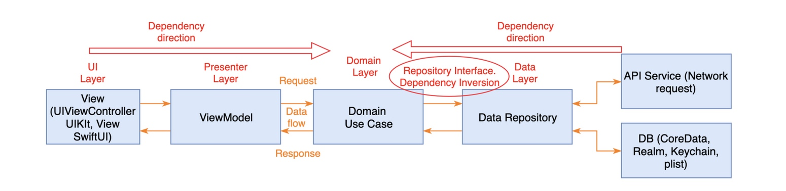

# ``GitHub-Users-List-App``

## Overview

The architecture of this project is based on onion architecture (aka clean architecture).

Layers are grouped by: **Presentation**, **Domain**, **Data Layer**

**Domain** is the inner-most part of the onion. It contains Entities, UseCase and Repository.
* Entities: Business models, in this project, are UserListPage, UserRepo, and Owner.
* UseCase: Contains the application's specific business rules
* Repository: Responsible for coordinating data from different Data Sources.

**Presentation** contains UI (UIViewControllers). Views are coordinated by ViewModels (Presenters) which execute one or many Use Cases. The presentation layer depends only on the Domain Layer.

**Data Layer** contains Repository Implementations and one or many Data Sources. Repositories are responsible for coordinating data from different Data Sources. In this project, there is only one remote Data Source - DataTransferService.

### Dependency Direction & Data Flow

## Requirements
* Xcode 13.0+
* Swift 5.5
* iOS 15.0+

## Build & Run

1. Install dependencies by Swift Package Manager, this may be automatically done by the Xcode.
2. **Optional**: Since GitHub API has a mechanism called **rate-limit**, every normal user can only send 10 requests within a certain period of time. I suggest to config an access_token to this project in `Targets -> GitHub-Users-List-App -> Build Setting -> User-Defined -> ACCESS_TOKEN`. By configuring this, you can get 30 requests.
3. Build and run the project on devices or simulators with iOS 15.0+.

