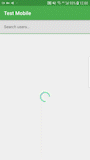

# MVVM-Architecture
The application was created using MVVM coupled with Android architecture components and Dependency Injection.
The UI was designed using Google Material Design.

## Gif


### Application Dependencies

* [LiveData - An observable data holder class. LiveData is lifecycle-aware, meaning it respects the lifecycle of other app components, such as activities, fragments, or services.
 This awareness ensures LiveData only updates app component observers that are in an active lifecycle state](https://developer.android.com/topic/libraries/architecture/livedata).
* [ViewModel - Allows data to survive configuration changes](https://developer.android.com/topic/libraries/architecture/viewmodel)
* [Paging 3 - Makes it easier for you to load data gradually and gracefully within your app's RecyclerView](https://developer.android.com/topic/libraries/architecture/paging/)
* [Android Data Binding - Using a declarative format, it allows the UI components in the layouts to be bind to the app sources](https://developer.android.com/topic/libraries/data-binding)
* [Retrofit2 - Type-safe HTTP client for Android and Java](https://github.com/square/retrofit).
* [Google Material Design - Created to help build high quality experiences for Android, IOS & Web](https://material.io/design/introduction#principles)
* [Dagger Hilt - Dependency hilt with Hilt. Hilt provides a standard way to use DI in your application by providing containers for every Android class in your project and managing their lifecycles automatically](https://developer.android.com/training/dependency-injection/hilt-android)
* [Glide - An image loading and caching library for android](https://github.com/bumptech/glide)
* [Avatar Image View - A fast roundable and strokeable ImageView for show avatar](https://github.com/alvince/AvatarImageView)
* [Finest Web View - Beautiful and customizable Android Activity that shows web pages within an app](https://github.com/TheFinestArtist/FinestWebView-Android)

### Testing
* [Expresso - The Espresso API encourages test authors to think in terms of what a user might do while interacting with the application - locating UI elements and interacting with the](https://developer.android.com/training/testing/espresso/)
* [Mockito  - A  framework that tastes really good. It lets you write beautiful tests with a clean & simple API](https://site.mockito.org)


### To run the application

- clone the project
```shell
   git clone https://github.com/DataSciGeek/test-mobile.git
```
- Open the project in *Android studio* or your preferred editor
- Download the project required files
- Build the project
- Run the application on an emulator or real device after a succesful build


