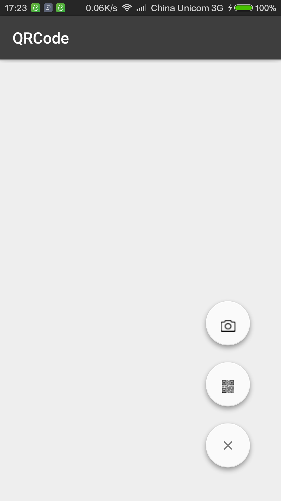
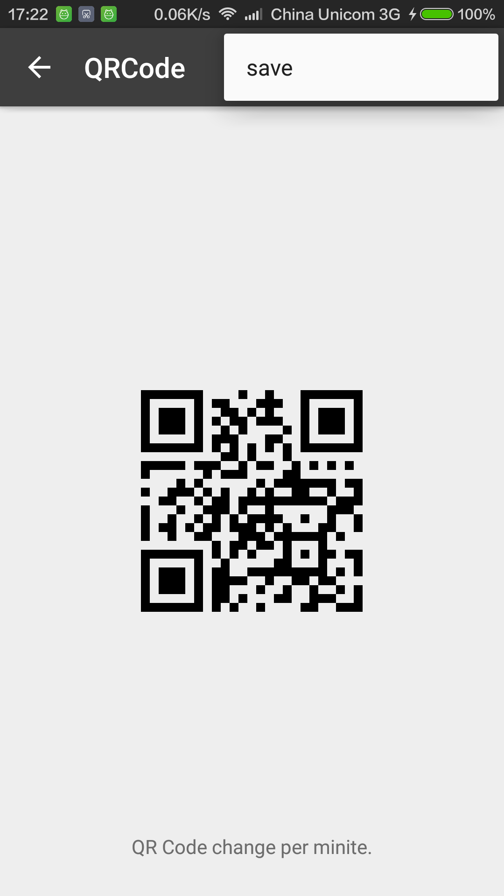
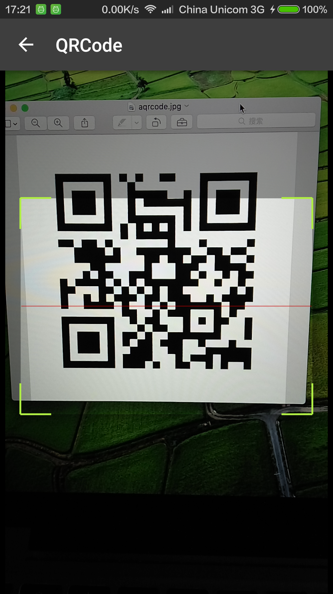
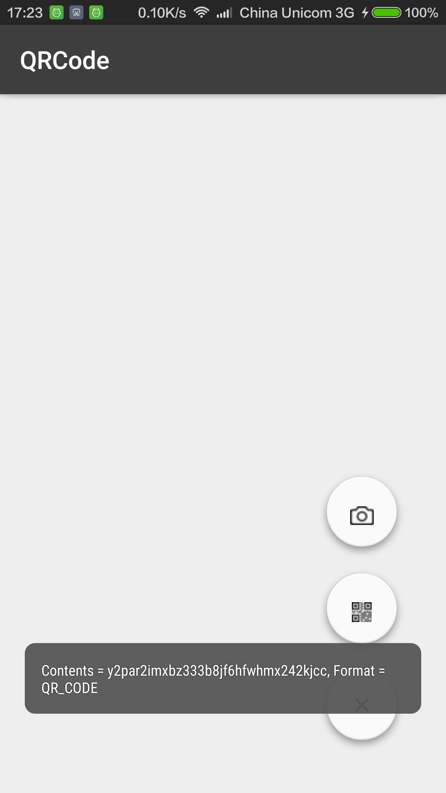

# Wiredcraft Mobile Developer Coding Test

Make sure you read **all** of this document carefully, and follow the guidelines in it.

## Requirements

- With clear documentation on how to run the code and api usage;

- Mobile application should follow apple/google design pattern;

- Provide proper unit test;

- Choose either sql or no-sql database to make the data persistence;

- Use git to manage code;

## What We Care About

Feel free to use any libraries you would use if this were a real production app, but remember we're interested in your code & the way you solve the problem, not how well you can use a particular library.

We're interested in your method and how you approach the problem just as much as we're interested in the end result.

Here's what you should aim for:

- Good use of some third part library or use your own;

- Solid testing approach;

- Extensible code;

## Q&A

* Where should I send back the result when I'm done?

Fork this repo and send us a pull request when you think you are done. We don't have deadline for the task.

* What if I have question?

Create a new issue in the repo and we will get back to you very quickly.

## Libs used
####Support lib, Material Design
Design,[Floatingactionbutton](https://github.com/futuresimple/android-floating-action-button)
####Network
[Retrofit](https://github.com/dm77/barcodescanner)
####QRCode
[zxing](https://github.com/zxing/zxing),[scanner](https://github.com/dm77/barcodescanner)
####Others
[leakcanary](https://github.com/square/leakcanary)

## Structure
  The QRServer is the api server project by Nodejs,need npm install express.
  The QRClient is the android project.

## PreView
####Material Design Home：

####Generate the QRCode：

####Scaner and the result：

 

