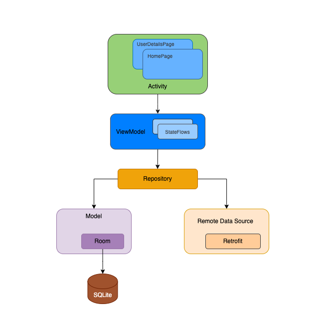

# Mobile Test - GitHub Users List App

Make sure you read the whole document carefully and follow the guidelines in it.

## Context

We are building an App, which is used to list Github user profiles.

## Requirements

### Design

https://www.figma.com/file/voov7DANpki5YtI6Jt5d6E/github_userlist_test?node-id=0%3A1

### User Stories

Click to view details

1. As a user on app first launch,
    - When I reach the home page
    - Then I should see a list of GitHub users.
    - Each user item on this page should display as below:
        - avatar at left and center vertically
        - right part has a button, when I tap it, it will switch between `FOLLOW` and `FOLLOWED`, The FOLLOW state can be a local strategy
        - next to avatar has two lines of text which vertically centered with avatar
        - first line contains name and score, you can use `login` and `score`
        - score is always aligned next to name on the right with a small margin
        - when name is too long and pushes score to the edge of button, keep score displayed in full and shrink name label by trimming the end of text (ex. "verylongname... 109.45402")
        - second line is URL, you can use `html_url`
    - And I should see a search box
2. As a user on the home page,
  - When I tap on a user item
  - Then I should see the user's details
3. As a user on the home page,
  - When I focus on to the search bar
  - And enter search terms
  - Then I should see the corresponding new result lists based on the search terms real time
4. As a user on the home page,
  - When I pull the list down
  - And the list reach Top
  - Then I should see the list refresh
5. As a user on the home page,
  - When I scroll up
  - And the list reach bottom
  - Then I should be able continue scrolling to see next page's data
6. As a user on the user details page,
  - Then I should see:
    - the header view which is fixed and won't animate when the list scrolls
    - the avatar of this user which is the same as displayed in the homepage
    - the name of this user which is the same as diplayed in the hompage
    - the button has the same status as on the homepage for the same item
    - the repositories list which has the same cell style as the homepage, but different datasource
        - avatar: `owner.avatar_url`
        - name: `name`
        - score: `stargazers_count`
        - url: `html_url`
        - button is hidden in this case
7. As a user on the homepage or on the user details page
  - When I tap on the button in header view
  - And the button status is switched between `FOLLOW` and `FOLLOWED`
  - Then I back to the homepage, the row which has the same user will have the same button status as in the user details page

### Technical architecture

### Functionality

- Use Swift >=4.2 for iOS.
- Use Kotlin >=1.6 for Android.
- Provide proper unit tests.
- For API use this: 
  - https://api.github.com/search/users?q=swift&page=1, or similar.
  - https://api.github.com/users/swift/followers
  - https://api.github.com/users/swift/repos

### Bonus

- Write clear documentation on how it's designed and how to run the code.
- Write good in-code comments.
- Write good commit messages.
- Use Jetpack Compose for Android.
- Use SwiftUI for iOS.

### Advanced requirements

*These are used for some further challenges. You can safely skip them if you are not asked to do any, but feel free to try out.*

- Animate the header view when list view scrolls on user detail page

## What We Care About

Feel free to use any open-source library as you see fit, but remember that we are evaluating your coding skills and problem solving skills.

Here's what you should aim for:

- Good use of current Android & Swift best practices.
- We are usually interested in how you use Structs, Enums, Extensions, and Protocol Oriented Programming etc.
- Good testing approach.
- Extensible code.

## FAQ

> Where should I send back the result when I'm done?

Fork this repo and send us a pull request when you think it's ready for review. You don't have to finish everything prior and you can continue to work on it. We don't have a deadline for the task.

> What if I have a question?

Create a new issue in the repo and we will get back to you shortly.
